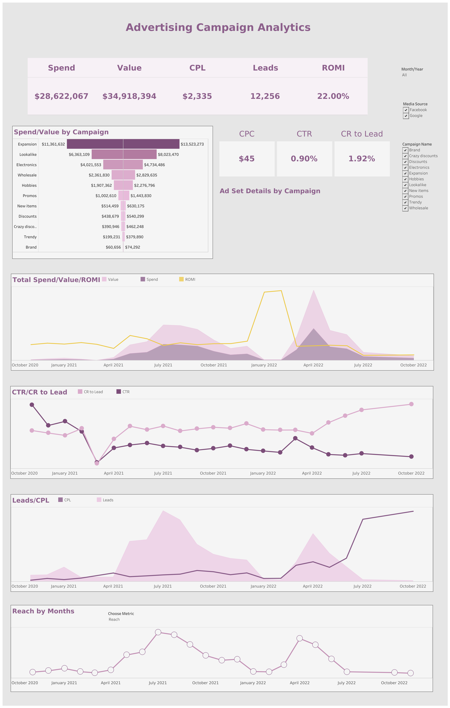

📊 Advertising Campaign Analytics Dashboard

An interactive dashboard for in-depth analysis of marketing campaign performance. This tool enables users to navigate from high-level business KPIs down to a granular audit of specific Ad Sets.

Objective: To optimize marketing expenditures and identify the most profitable traffic acquisition channels through data-driven insights.

🚀 Key Features
Executive Summary: Instant overview of core metrics (Spend, Value, CPL, Leads, ROMI) via dynamic KPI scorecards.

Campaign Drill-down: Interactive "Spend/Value by Campaign" chart serving as the primary filter for the entire dashboard.

Trend Analysis: Visualization of key metric dynamics over time to identify patterns and anomalies.

Ad Set Performance: A detailed table with conditional formatting that reveals specific Ad Set data upon clicking a campaign, enabling immediate identification of underperforming ads.

🛠 Technical Implementation
Tool: Tableau Desktop.

Advanced Actions: Configured complex Dashboard Actions for seamless, zero-reload filtering across all sheets.

Data Modeling: Advanced Calculated Fields for automated ROMI, CR, and MoM (Month-over-Month) dynamics.

UX Design: Applied the "Top-down" approach (General to Specific) and eliminated visual noise to enhance focus on actionable data.

📈 Actionable Business Insights
Real-time Budget Optimization: Detect campaigns with abnormally high CPL on dynamic charts to quickly reallocate budget toward more efficient channels.

Scaling Success: Identify Ad Sets with high ROMI but low reach as primary candidates for budget increases.

Creative Quality Audit: Compare CTR and CR (Conversion Rate) to pinpoint where users drop off—determining if the issue lies with the ad creative or the landing page conversion.

Seasonality & Trend Management: Leverage MoM analytics to distinguish natural market fluctuations from campaign configuration errors.

[View on Tableau Public](https://public.tableau.com/views/AdvertisingCampaignAnalystics/AdvertisingCampaignAnalytics?:language=en-US&:sid=&:redirect=auth&:display_count=n&:origin=viz_share_link)
